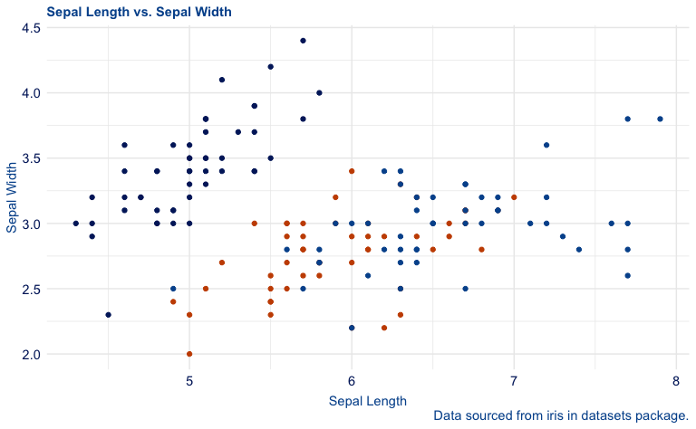
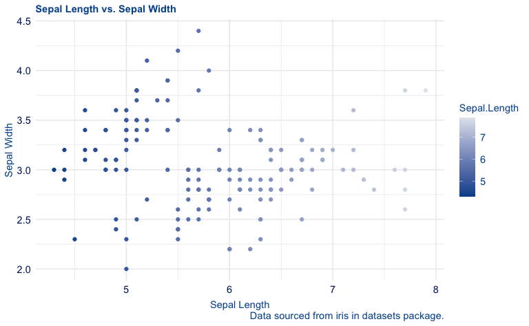

# duke

<!-- badges: start -->

[](https://github.com/aidangildea/duke/actions/workflows/R-CMD-check.yaml)
<!-- badges: end -->

## Overview

**duke** allows users to generate visualizations with Duke’s official
suite of colors in a color blind friendly way. By using it alongside
**ggplot2**, you can easily promote accessibility in the Duke community
and beyond.

## Installation

You can install the official version of `duke` from CRAN with:

``` r
# Install duke directly:
install.packages("duke")
```

Or alternatively, you can install the development version from GitHub:

``` r
# install.packages("devtools")
devtools::install_github("aidangildea/duke")
```

## Usage

This package is fully integrated with ggplot2, and therefore, allows you
to customize several visualization features such as the theme and color
scales of your plots created with ggplot2.

## Example

By using **duke** functions, you can easily convert your visualizations
to Duke official colors.

``` r
library(ggplot2)
library(duke)

plot1 <- ggplot(mpg, aes(cty, hwy)) +
  geom_point(aes(colour = fl)) +
  labs(
    title = "City Miles per Gallon vs. Highway Miles per Gallon By Fuel Type",
    caption = "Data sourced from mpg in ggplot2 package.",
    x = "City Miles per Gallon (MPG)", 
    y = "Highway Miles per Gallon (MPG)"
  )

plot2 <- ggplot(mpg, aes(cty, hwy)) +
  geom_point(aes(color = cyl)) +
  labs(
    title = "City Miles per Gallon vs. Highway Miles per Gallon By Cylinders", 
    caption = "Data sourced from mpg in ggplot2 package.", 
    x = "City Miles per Gallon (MPG)", 
    y = "Highway Miles per Gallon (MPG)"
  )
```

Then, by pairing them with functions from this package, you can convert
them into Duke-branded and colorblind-friendly versions.

``` r
plot1 +
  theme_duke() +
  scale_duke_color_discrete()
```



``` r

plot2 +
  theme_duke() +
  scale_duke_continuous()
```



## Questions

For further questions about this package and its use, please open an
issue.
